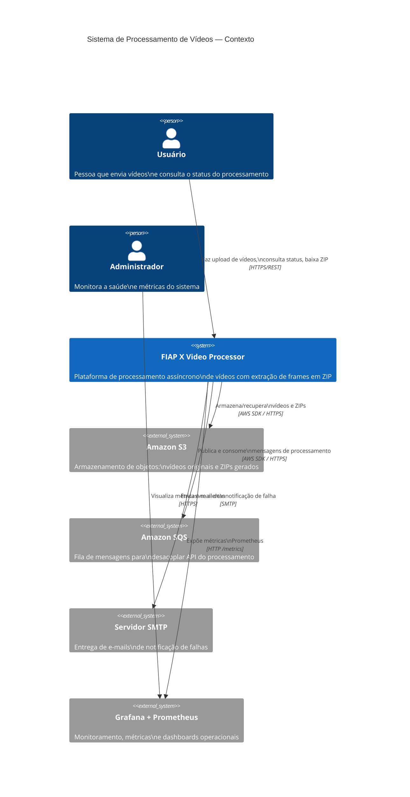
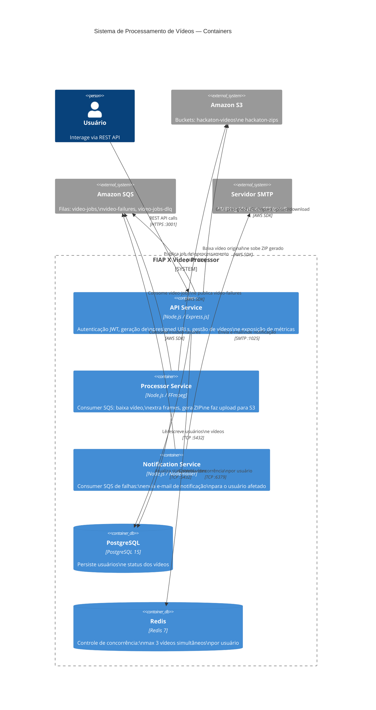
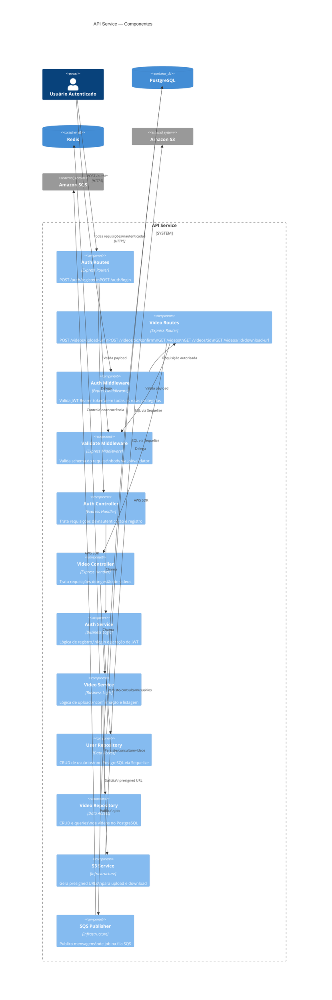
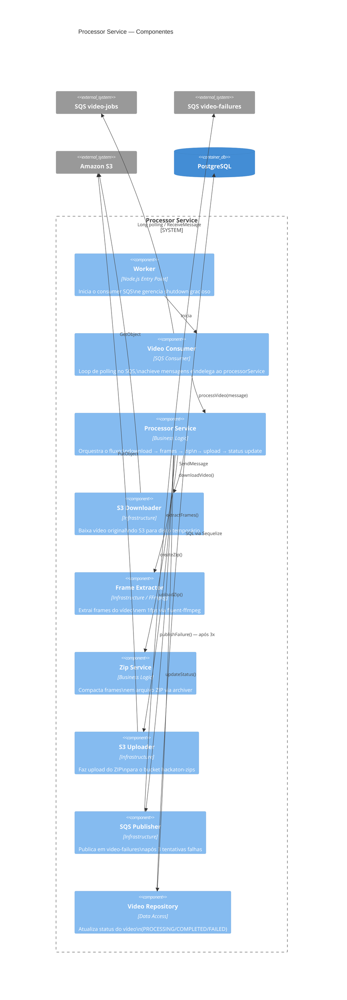
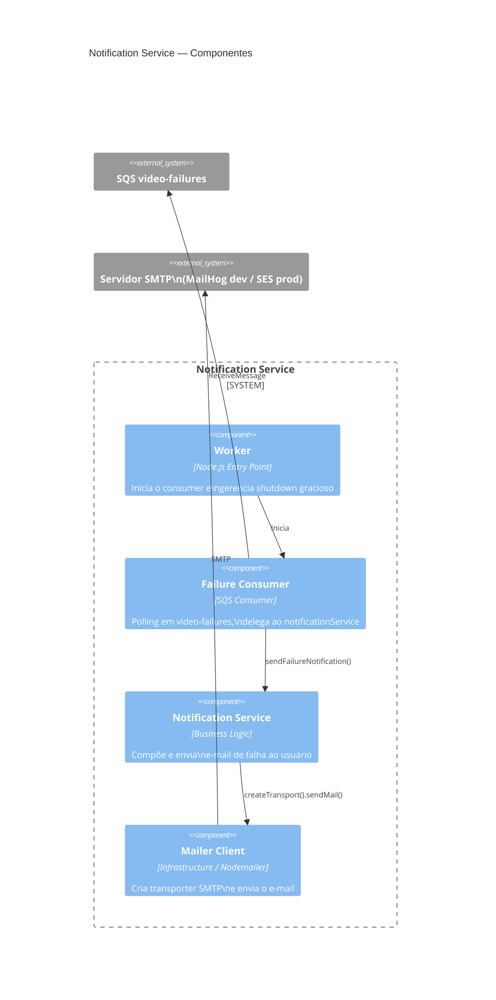
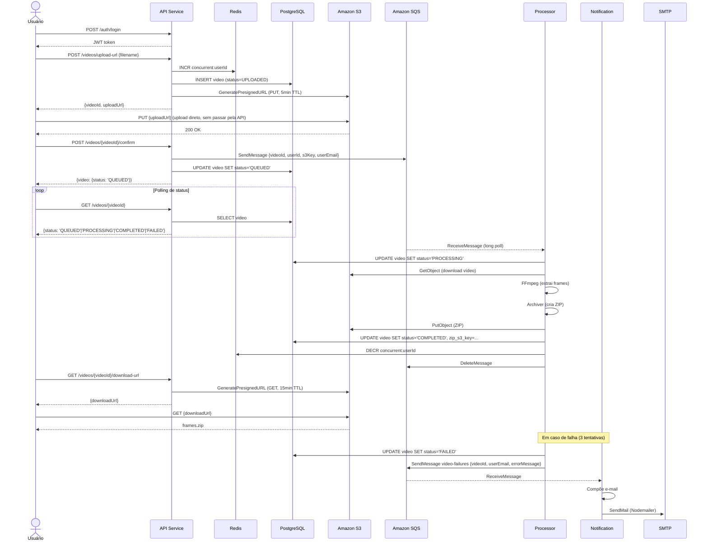

# C4 Model — Sistema de Processamento de Vídeos · FIAP X

> O **C4 Model** descreve a arquitetura de software em quatro níveis de abstração progressiva:  
> **Contexto → Containers → Componentes → Código**

---

## Nível 1 — Diagrama de Contexto do Sistema

Mostra o sistema como uma caixa preta e seus relacionamentos com usuários e sistemas externos.

---

## Nível 2 — Diagrama de Containers

Detalha os processos/aplicações que compõem o sistema e como se comunicam.

---

## Nível 3 — Diagrama de Componentes: API Service

Detalha os componentes internos do container mais complexo.

---

## Nível 3 — Diagrama de Componentes: Processor Service

---

## Nível 3 — Diagrama de Componentes: Notification Service

---

## Nível 4 — Fluxo de Dados: Upload de Vídeo (Sequência)

---

## Resumo da Arquitetura

| Nível C4 | Arquivo |
|----------|---------|
| Contexto + Containers + Componentes | Este documento |
| Design de alto nível | [HLD.md](HLD.md) |
| Código-fonte dos serviços | `services/` |
| Infraestrutura como código | `infrastructure/terraform/` |
